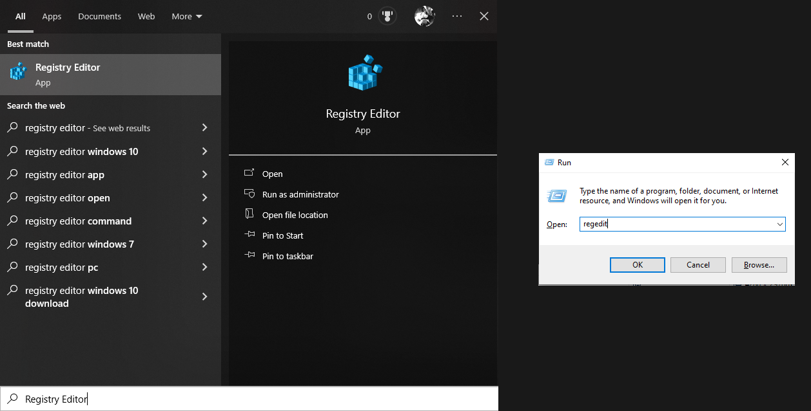
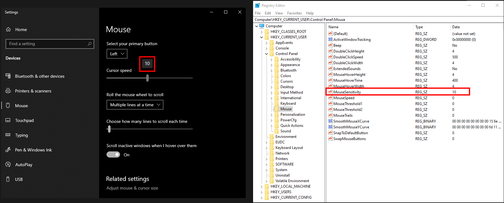
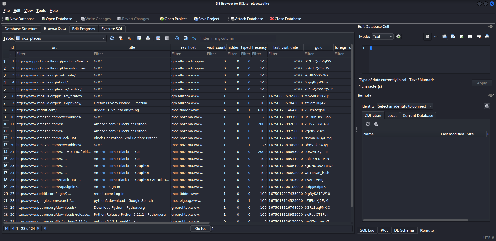
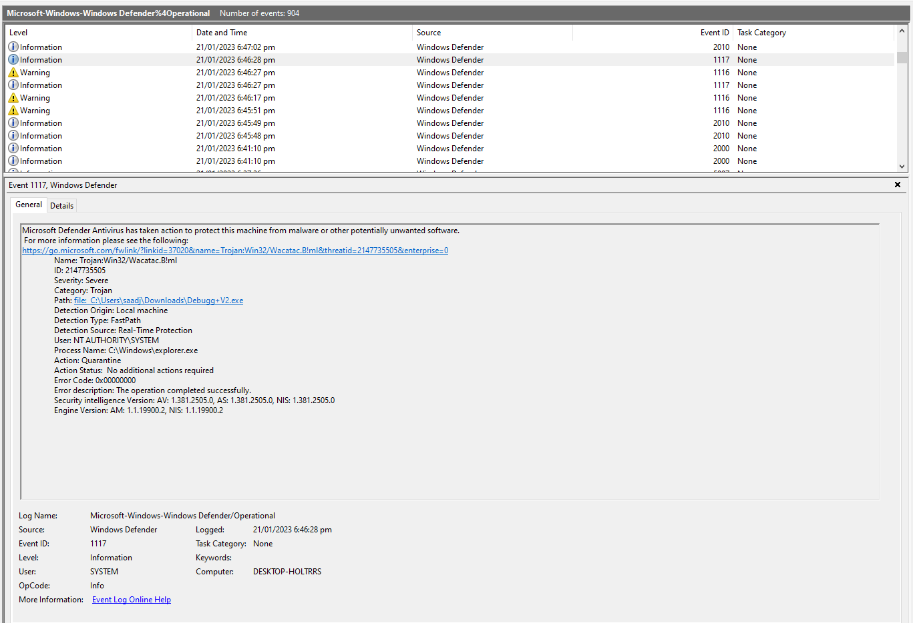

# Common Windows Artifacts

The windows operating system is composed of a large number of artifacts, including files, directories, logs, registries, browser history, user accounts and other important data which are essential for it to function properly.

In this lab, we’ll explore some such artifacts which are useful while conducting a forensics investigation, we’ll learn where such artifacts are placed, and how we can extract valuable information out of them.

# Windows Registry

The Windows Registry is a hierarchical database that stores configurations for users, applications, and hardware devices. Here's how Microsoft describes it:

> The Registry contains information that Windows continually references during operation, such as profiles for each user, the applications installed on the computer and the types of documents that each can create, property sheet settings for folders and application icons, what hardware exists on the system, and the ports that are being used.
> 

The Windows Registry is composed of five main root keys, also known as hives, under the root key `Computer`, these are:

- `HKEY_CURRENT_USER (HKCU)` — contains information about the logged in user, including screen colors, and control panel settings.
- `HKEY_USERS (HKU)` — contains information about actively loaded user profiles on the system, including profiles and settings.
- `HKEY_LOCAL_MACHINE (HKLM)` — contains information about the system configuration (for any user).
- `HKEY_CLASSES_ROOT (HKCR)` — contains information about file types and their associated programs.
- `HKEY_CURRENT_CONFIG (HKCC)` — contains information about the hardware profile of the system.

Each of these keys contains a hierarchy of subkeys and values that store specific information about the system and its configuration. For example, the configuration for the mouse, such as sensitivity, and double click speed are stored in `Computer\HKEY_CURRENT_USER\Control Panel\Mouse`. We can also visualize it as a tree where each branch represents a subkey:

```
Computer
|__ HKEY_CURRENT_USER
	|__ Control Panel
		|__ Mouse
```

Registry keys can be viewed and modified by using the built-in Registry Editor. Following are two ways to open it, through the Search bar or by using the Run command (Win + R).



To test it out, we can modify the mouse sensitivity in settings and see the changes reflected in registry keys.



An alternative approach is to do it the other way around by first modifying the registry keys, and then seeing the changes after rebooting the computer or signing out and signing back in.

## NTUSER.DAT

The `NTUSER.DAT` file is a user profile hive that is part of the registry. The per user configurations are stored in `C:\Users\%USERNAME%\NTUSER.DAT`. 

The contents of the `NTUSER.DAT` file can be accessed using Registry Explorer by Eric Zimmerman as shown in the image below.


The tool can be downloaded from [https://f001.backblazeb2.com/file/EricZimmermanTools/net6/RegistryExplorer.zip](https://f001.backblazeb2.com/file/EricZimmermanTools/net6/RegistryExplorer.zip).

# LNK Files

LNK files are the shortcut files that serve as a quick access to frequently used files, folders, or programs on the system. These files typically have a `.lnk` file extension and can be found in locations such as the desktop, start menu, and recent documents folder.

Whenever a file is accessed for the first time, a `.lnk` file gets created in the Recents folder. This information is particularly useful in identifying when a file was first accessed.

These files are usually found in: 

- `C:\Users\%USERNAME%\Recent`
- `C:\Users\%USERNAME%\AppData\Roaming\Microsoft\Windows\Recent`
- `C:\Users\%USERNAME%\AppData\Roaming\Microsoft\Office\Recent`
- `C:\Users\%USERNAME%\Desktop`

One way to explore LNK files and extract useful information from them is by using a tool called LECmd. We can use it to extract original full path of the file, the date and time the file was created, last modified, last accessed, the desktop name, and the MAC address of the system where the file was created. 

The tool can be downloaded from [https://github.com/EricZimmerman/LECmd](https://github.com/EricZimmerman/LECmd) and here’s how you can use it to extract useful information from a `.lnk` file:

```
PS C:\Tools\LECmd> LECmd.exe -f passwd.lnk
LECmd version 1.5.0.0

Author: Eric Zimmerman (saericzimmerman@gmail.com)
https://github.com/EricZimmerman/LECmd

Command line: -f .\passwd.lnk

Warning: Administrator privileges not found!

Processing C:\Tools\LECmd\passwd.lnk

Source file: C:\Tools\LECmd\passwd.lnk
  Source created:  2021-03-15 08:25:27
  Source modified: 2021-03-15 10:36:47
  Source accessed: 2023-01-28 16:24:36

--- Header ---
  Target created:  2021-03-15 08:25:07
  Target modified: 2021-03-15 08:26:59
  Target accessed: 2021-03-15 08:27:07

  File size: 13
  Flags: HasTargetIdList, HasLinkInfo, HasRelativePath, HasWorkingDir, IsUnicode, DisableKnownFolderTracking
  File attributes: FileAttributeArchive
  Icon index: 0
  Show window: SwNormal (Activates and displays the window. The window is restored to its original size and position if the window is minimized or maximized.)

Relative Path: ..\..\..\..\..\Desktop\passwd.txt
Working Directory: C:\Users\Challenger\Desktop

--- Link information ---
Flags: VolumeIdAndLocalBasePath

>> Volume information
  Drive type: Fixed storage media (Hard drive)
  Serial number: 02916957
  Label: (No label)
  Local path: C:\Users\Challenger\Desktop\passwd.txt

--- Target ID information (Format: Type ==> Value) ---

  Absolute path:

  -File ==> (None)
    Short name: passwd.txt
    Modified:    2021-03-15 08:27:00
    Extension block count: 1

<SNIP>

--- End Target ID information ---

--- Extra blocks information ---

>> Tracker database block
   Machine ID:  desktop-rsrl4hd
   MAC Address: 08:00:27:2a:dc:e0
   MAC Vendor:  PCS SYSTEMTECHNIK
   Creation:    2021-03-11 06:29:01

   Volume Droid:       c2c1754c-762e-4361-8c04-e690782765de
   Volume Droid Birth: c2c1754c-762e-4361-8c04-e690782765de
   File Droid:         119740ae-8233-11eb-9779-0800272adce0
   File Droid birth:   119740ae-8233-11eb-9779-0800272adce0

<SNIP>

---------- Processed C:\Tools\LECmd\passwd.lnk in 0.25970300 seconds ----------
```

# Web Browsers

Web browsers are used globally for accessing websites. In the context of digital forensics, web browsers can provide a wealth of information about a user's browsing history, cookies, downloaded files, saved passwords, and much more. This information can be used to determine what a user might have been up to, and identify any potentially suspicious activity.

There are numerous browsers available online, but we’ll just be exploring the two most commonly used browsers, Firefox and Chrome.

## Firefox

Firefox stores its data that can be valuable during a digital forensics investigation under the directory `C:\Users\%USERNAME%\AppData\Roaming\Mozilla\Firefox\Profiles`. This includes cookies, saved logins, browsing history, bookmarks, and some other useful information stored in `.sqlite` and `.json` files. 

To view `.json` files, we can use any text editor as shown in the image below.


However, the `.sqlite` files require a DB Browser such as `sqlitebrowser` that comes built-in with Kali Linux. Here’s how we can use `sqlitebrowser` to view `.sqlite` files:

```
$ sqlitebrowser places.sqlite
```



### Saved Logins

Firefox encrypts the saved logins using a master key in the file `key4.db` located in the profile's directory. To extract usernames and passwords, we can use a tool called `firefox_decrypt` that can be downloaded from [https://github.com/unode/firefox_decrypt](https://github.com/unode/firefox_decrypt). 

The following commands demonstrate how to download and use this tool.

```
$ git clone https://github.com/unode/firefox_decrypt 
Cloning into 'firefox_decrypt'...
remote: Enumerating objects: 1163, done.
remote: Counting objects: 100% (275/275), done.
remote: Compressing objects: 100% (40/40), done.
remote: Total 1163 (delta 250), reused 238 (delta 233), pack-reused 888
Receiving objects: 100% (1163/1163), 414.55 KiB | 1.14 MiB/s, done.
Resolving deltas: 100% (732/732), done.
```

```
$ python3 firefox_decrypt.py hxdvwqnb.default-release 

Website:   https://www.facebook.com
Username: 'john.doe@example.com'
Password: 'my_password123'

Website:   https://twitter.com
Username: 'john_doe'
Password: 'my_twitter_password123'

Website:   https://google.com
Username: 'john.doe@gmail.com'
Password: 'some_random_p4ssw0rd'
```

## Chrome

While we covered in detail how to extract saved passwords from Firefox using the `firefox_decrypt` tool, we will not be diving into the process of extracting saved passwords from Chrome. However, It’s worth noting that Chrome stores its data including saved passwords, cookies, and other useful information under the directory `C:\Users\%USERNAME%\AppData\Local\Google\Chrome\User Data\Default`. This data is encrypted by default, but the key can be found in the directory `C:\Users\%USERNAME%\AppData\Local\Google\Chrome\User Data\Local State`. 

# Event Logs

Event logs provides records of important system, security, and application events. These logs are automatically generated by Windows, and can provide valuable information during a digital forensics investigation.

The event logs are stored in `C:\Windows\System32\winevt\Logs` and can be viewed and analyzed using the Event Viewer, a built-in tool in Windows.

Out of the three types of event logs i.e., system, security, and application logs, only the security logs will be of interest to us. The log files that may contain security related events include:

- `Security.evtx`
- `Microsoft-Windows-Windows Defender%4Operational.evtx`
- `Microsoft-Windows-Windows Firewall With Advanced Security%4Firewall.evtx`
- `Microsoft-Windows-PowerShell%4Operational.evtx`

However, it's worth noting that these are not the only files that may be useful during a digital forensics investigation, but for this lab, we are interested in these files only.

Each of the events have a specific id associated with them, which can be used to identify and filter specific events of interest. For example, the event ID for a user logging in would be `4624`, while the event ID for a user logging out would be `4634`. The following table lists some common security-related event IDs and provides a brief summary of the information that can be gathered from each event:

| Event ID | Event Summary |
| --- | --- |
| 1006 | The antimalware engine found malware or other potentially unwanted software. |
| 1007 | The antimalware platform performed an action to protect your system from malware or other potentially unwanted software. |
| 1015 | The antimalware platform detected suspicious behavior. |
| 1116 | The antimalware platform detected malware or other potentially unwanted software. |
| 1117 | The antimalware platform performed an action to protect your system from malware or other potentially unwanted software. |
| 1100 | The event logging service has shut down. |
| 1102 | The audit log was cleared. |
| 4624 | An account was successfully logged on. |
| 4625 | An account failed to log on. |
| 4634 | An account was logged off. |
| 4648 | A logon was attempted using explicit credentials. |
| 4720 | A user account was created. |
| 4722 | A user account was enabled. |
| 4723 | An attempt was made to change an account's password. |
| 4724 | An attempt was made to reset an account's password. |

Here’s an example of event ID `1117` in the file `Microsoft-Windows-Windows Defender%4Operational.evtx`, viewed using the built-in Event Viewer.



# Exercises

1. Given the registry file of a system that was compromised, answer the following:
    1. What’s the mouse double-click speed?
    2. What’s the most recent typed path accessed as recorded in the registry?
    3. What’s the new value added to the registry by the malware in order to establish persistence over the system?
    
    The registry file can be downloaded from [https://github.com/vonderchild/digital-forensics-lab/blob/main/Lab 02/files/NTUSER.DAT](https://github.com/vonderchild/digital-forensics-lab/blob/main/Lab%2002/files/NTUSER.DAT)
    
2. Given the Firefox profile of a suspect, answer the following:
    1. What’s the username and password stored in the saved logins?
    2. What’s the most frequently visited website?
    3. What’s the name of the file downloaded by the suspect?
    
    The Firefox profile can be downloaded from [https://github.com/vonderchild/digital-forensics-lab/blob/main/Lab 02/files/Firefox.zip](https://github.com/vonderchild/digital-forensics-lab/blob/main/Lab%2002/files/Firefox.zip)
    
3. Given the PowerShell Event logs of a compromised system, answer the following:
    1. What’s the command executed by the attacker to download a file on the system?
    2. Can you analyze the downloaded file and understand what’s the purpose of that file?
    
    The event logs file can be downloaded from [https://github.com/vonderchild/digital-forensics-lab/blob/main/Lab 02/files/Microsoft-Windows-PowerShell%254Operational.evtx](https://github.com/vonderchild/digital-forensics-lab/blob/main/Lab%2002/files/Microsoft-Windows-PowerShell%254Operational.evtx)